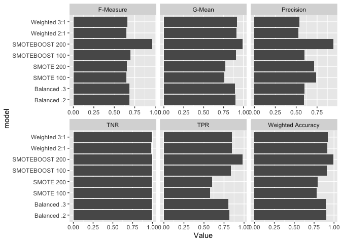

Presentation Code
================
Justin Arends
2022-10-13

# Performance Measures

-   With unbalanced data, overall accuracy is often inappropriate
-   True negative, true positive, weighted accuracy, G-mean, precision,
    recall, and F-measure

$True\ Negative (Acc^-) = \frac{TN}{TN + FP}$  
$True\ Positive (Acc^+)= \frac{TP}{FP + FN}$  
$G-mean = (Acc^- \times Acc^+)^{1/2}$  
$Weighted\ Accuracy = \beta Acc^- + (1-\beta)Acc^-$  
$Precision = \frac{TP}{TP+FN}$  
$Recall = \frac{TP}{TP+FN} = Acc^+$  
$F-Measure = \frac{2 \times Precision \times Recall}{Precision+Recall}$

# Measures

## Custom Measures based on the out-of-the-box in `tidymodels`

``` r
f_meas_beta_vec <- function(truth,
                            estimate,
                            estimator = NULL,
                            na_rm = TRUE,
                            event_level = "second",
                            ...) {
  f_meas_vec(
    truth = truth, 
    estimate = estimate, 
    beta = 1, 
    estimator = estimator,
    na_rm = na_rm,
    event_level = "second",
    ...
  )
}

f_meas_beta <- function(data,
                        truth,
                        estimate,
                        estimator = NULL,
                        na_rm = TRUE,
                        event_level = "second",
                        ...) {
  metric_summarizer(
    metric_nm = "f_meas_beta", 
    metric_fn = f_meas_beta_vec, 
    data = data, 
    truth = !!enquo(truth), 
    estimate = !!enquo(estimate), 
    estimator = estimator, 
    na_rm = na_rm, 
    event_level = "second", 
    ...
  )
}


recall_second_vec <- function(truth,
                            estimate,
                            estimator = NULL,
                            na_rm = TRUE,
                            event_level = "second",
                            ...) {
  recall_vec(
    truth = truth, 
    estimate = estimate, 
    estimator = estimator,
    na_rm = na_rm,
    event_level = "second",
    ...
  )
}

recall_second <- function(data,
                        truth,
                        estimate,
                        estimator = NULL,
                        na_rm = TRUE,
                        event_level = "second",
                        ...) {
  metric_summarizer(
    metric_nm = "recall_second_vec", 
    metric_fn = recall_second_vec, 
    data = data, 
    truth = !!enquo(truth), 
    estimate = !!enquo(estimate), 
    estimator = estimator, 
    na_rm = na_rm, 
    event_level = "second", 
    ...
  )
}
test_f <- new_class_metric(f_meas_beta,"maximize")
test_recall <- new_class_metric(recall_second, "maximize")
```

### Custom Measures based on the paper

``` r
metrics <- function(conf_mat){
  TP = conf_mat$table[2,2]
  FP = conf_mat$table[1,2]
  TN = conf_mat$table[1,1]
  FN = conf_mat$table[2,1]
  
  precision = TP/(TP+FP)
  TNR = TN / (TN+FP)
  TPR = TP / (TP+FN)
  
  gMean = (TNR * TPR)^(1/2)
  
  fMeasure = (2*precision*TPR)/(precision + TPR)
  
  wAccuracy = (.5*TPR) + (1-.5)*TNR
  
  return(
    tibble(
      "Measure" = c("Precision", "TNR", "TPR", "G-Mean", "F-Measure", "Weighted Accuracy"),
      "Value" = c(precision, TNR,TPR, gMean, fMeasure, wAccuracy)
    )
  )
}
```

# Modeling

## Oil Data

I’m going to start a test with oil data since it’s smaller and faster to
iterate over.

``` r
oil_data <- read_csv("https://github.com/jbrownlee/Datasets/raw/master/oil-spill.csv",col_names = NULL)
```

    ## Rows: 937 Columns: 50
    ## ── Column specification ────────────────────────────────────────────────────────
    ## Delimiter: ","
    ## dbl (50): X1, X2, X3, X4, X5, X6, X7, X8, X9, X10, X11, X12, X13, X14, X15, ...
    ## 
    ## ℹ Use `spec()` to retrieve the full column specification for this data.
    ## ℹ Specify the column types or set `show_col_types = FALSE` to quiet this message.

``` r
# X51 is the classification column

oil_data$X50 <- as.factor(oil_data$X50)
```

Create different folds

``` r
set.seed(1234)

oil.split <- initial_split(oil_data, strata = X50)
oil.train <- training(oil.split)
oil.test <- training(oil.split)

set.seed(456)

oil.folds <- vfold_cv(oil.train, strata = X50)

oil.boots <- bootstraps(oil.train, strata = X50, pool = .5)
```

Creating a basic recipe

``` r
oil.recipe <- recipe(X50 ~., data = oil.train) %>% 
  update_role(X1, new_role = 'id')
oil.rf.spec <- 
  rand_forest(trees = 1000,
              mode = "classification") %>% 
  set_engine("ranger")

oil.rf.wf <- 
  workflow() %>% 
  add_recipe(oil.recipe) %>% 
  add_model(oil.rf.spec)


prep(oil.recipe) %>% juice() %>% count(X50)
```

    ## # A tibble: 2 × 2
    ##   X50       n
    ##   <fct> <int>
    ## 1 0       672
    ## 2 1        30

Fitting with the basic model on the oild data. Using `tidymodel's` out
of the box metrics…

``` r
set.seed(123)
doParallel::registerDoParallel()
oil.fold.fit <- 
  oil.rf.wf %>% 
  fit_resamples(oil.boots, metrics=metric_set(accuracy, 
                                              roc_auc, 
                                              specificity,
                                              recall,
                                              f_meas,
                                              test_f,
                                              sens,
                                              recall,
                                              test_recall,
                                              precision
                                              ),
                control = control_grid(save_pred = TRUE))

oil.fold.fit %>% 
  collect_metrics()
```

    ## # A tibble: 9 × 6
    ##   .metric           .estimator  mean     n  std_err .config             
    ##   <chr>             <chr>      <dbl> <int>    <dbl> <chr>               
    ## 1 accuracy          binary     0.962    25 0.00199  Preprocessor1_Model1
    ## 2 f_meas            binary     0.981    25 0.00104  Preprocessor1_Model1
    ## 3 f_meas_beta       binary     0.366    22 0.0209   Preprocessor1_Model1
    ## 4 precision         binary     0.964    25 0.00204  Preprocessor1_Model1
    ## 5 recall            binary     0.998    50 0.000374 Preprocessor1_Model1
    ## 6 recall_second_vec binary     0.212    25 0.0218   Preprocessor1_Model1
    ## 7 roc_auc           binary     0.897    25 0.0106   Preprocessor1_Model1
    ## 8 sens              binary     0.998    25 0.000534 Preprocessor1_Model1
    ## 9 specificity       binary     0.212    25 0.0218   Preprocessor1_Model1

They yield slightly different results, so I’ll go ahead and leverage the
custom metrics I build based on the paper’s formula.

``` r
oil.fold.fit %>% 
  collect_predictions() %>% 
  conf_mat(truth = X50, estimate = .pred_class) %>%
  metrics()
```

    ## # A tibble: 6 × 2
    ##   Measure           Value
    ##   <chr>             <dbl>
    ## 1 Precision         0.210
    ## 2 TNR               0.964
    ## 3 TPR               0.824
    ## 4 G-Mean            0.891
    ## 5 F-Measure         0.334
    ## 6 Weighted Accuracy 0.894

I think this is fairly close to the “one-sided sampling” table of the
oil data. So, I’ll use this structure on the Mammography data.

# Mammography

``` r
mam.data <- read_csv("https://github.com/jbrownlee/Datasets/raw/master/mammography.csv", 
                     col_names  = NULL) %>% 
  mutate(X7 = as.factor(ifelse(X7 =="'-1'", 0, 1)))
```

    ## Rows: 11183 Columns: 7
    ## ── Column specification ────────────────────────────────────────────────────────
    ## Delimiter: ","
    ## chr (1): X7
    ## dbl (6): X1, X2, X3, X4, X5, X6
    ## 
    ## ℹ Use `spec()` to retrieve the full column specification for this data.
    ## ℹ Specify the column types or set `show_col_types = FALSE` to quiet this message.

``` r
mam.data %>% 
  count(X7)
```

    ## # A tibble: 2 × 2
    ##   X7        n
    ##   <fct> <int>
    ## 1 0     10923
    ## 2 1       260

## Training/Testing Splits

Divide the data into training/testing/and folds.

``` r
set.seed(1234)

mam.split <- initial_split(mam.data, strata = X7)
mam.train <- training(mam.split)
mam.test <- training(mam.split)

set.seed(456)

mam.folds <- vfold_cv(mam.train, strata = X7)
```

## All the model recipes

``` r
# Baseline
mam.rec <- 
  recipe(X7 ~ ., data = mam.train)

# Upsample
mam.rec.balanced <- 
  recipe(X7 ~ ., data = mam.train) %>% 
  themis::step_upsample(X7, over_ratio = 1) 
```

### Smote

``` r
# Smote
mam.rec.smote.100 <- 
  recipe(X7 ~., data = mam.train) %>% 
  themis::step_smote(X7, over_ratio = 1)

mam.rec.smote.200 <- 
  recipe(X7 ~., data = mam.train) %>% 
  themis::step_smote(X7, over_ratio = 2)
```

### Class Weights

``` r
# Class Weights 
rf.spec_w2 <- 
  rand_forest(trees = 1000,
              mode = "classification") %>% 
  set_engine("ranger",
              class.weights = c(1,2))


rf.spec_w3 <- 
  rand_forest(trees = 1000,
              mode = "classification") %>% 
  set_engine("ranger",
              class.weights = c(1,3))
```

### Balanced Recipes

``` r
# Balanced Recipes
rf.spec.balanced.2 <- 
  rand_forest(trees = 1000,
              mode = "classification") %>% 
  set_engine("ranger",
              mtry = .2)

rf.spec.balanced.3 <- 
  rand_forest(trees = 1000,
              mode = "classification") %>% 
  set_engine("ranger",
              mtry = .3)
```

### Model Specifications and Workflow

``` r
# Model Specifications
rf.spec <- 
  rand_forest(trees = 1000,
              mode = "classification") %>% 
  set_engine("ranger")


mam.wf <- 
  workflow() %>% 
  add_recipe(mam.rec) %>% 
  add_model(rf.spec_w2)
```

# Resampling

``` r
set.seed(123)
doParallel::registerDoParallel(parallel::makeCluster(7))

mam.fold.fit.2 <-
  mam.wf %>%
  fit_resamples(
    mam.folds,
    metrics = metric_set(
      accuracy,
      roc_auc
    ),
    control = control_grid(save_pred = TRUE,
                           save_workflow = TRUE)
  )

mam.fold.fit.3 <-
  mam.wf %>% 
  update_model(rf.spec_w3) %>%
  fit_resamples(
    mam.folds,
    metrics = metric_set(
      accuracy,
      roc_auc
    ),
    control = control_grid(save_pred = TRUE,
                           save_workflow = TRUE)
  )

mam.fold.fit.smote.100 <- 
  mam.wf %>% 
  update_recipe(mam.rec.smote.100) %>%
  update_model(rf.spec) %>% 
  fit_resamples(
    mam.folds,
    metrics = metric_set(
      accuracy,
      roc_auc
    ),
    control = control_grid(save_pred = TRUE,
                           save_workflow = TRUE)
  )

mam.fold.fit.smote.200 <- 
  mam.wf %>% 
  update_recipe(mam.rec.smote.200) %>%
  update_model(rf.spec) %>% 
  fit_resamples(
    mam.folds,
    metrics = metric_set(
      accuracy,
      roc_auc
    ),
    control = control_grid(save_pred = TRUE,
                           save_workflow = TRUE)
  )

mam.fold.fit.balanced.2 <- 
  mam.wf %>% 
  update_recipe(mam.rec.balanced) %>%
  update_model(rf.spec.balanced.2) %>% 
  fit_resamples(
    mam.folds,
    metrics = metric_set(
      accuracy,
      roc_auc
    ),
    control = control_grid(save_pred = TRUE,
                           save_workflow = TRUE)
  )

mam.fold.fit.balanced.3 <- 
  mam.wf %>% 
  update_recipe(mam.rec.balanced) %>%
  update_model(rf.spec.balanced.3) %>% 
  fit_resamples(
    mam.folds,
    metrics = metric_set(
      accuracy,
      roc_auc
    ),
    control = control_grid(save_pred = TRUE,
                           save_workflow = TRUE)
  )
```

### Confusion Matrices

## SMOTEBoost

``` r
# Commenting all this out as I'm going to run a for loop for cross-validation
# Commenting all this out as I'm going to run a for loop for cross-validation
# Commenting all this out as I'm going to run a for loop for cross-validation
# Commenting all this out as I'm going to run a for loop for cross-validation
#

# library(ebmc)
# 
# #Models
# mam.train2 <- as.data.frame(mam.train)  
# 
# mam.fit.smote.100 <-
#   sbo(
#     X7 ~ .,
#     data = mam.train2,
#     size = 3,
#     alg = "rf",
#     over = 100,
#     svm.ker = "sigmoid",
#     rf.ntree = 500
#   )
# mam.fit.smote.300 <-
#   sbo(
#     X7 ~ .,
#     data = mam.train2,
#     size = 3,
#     alg = "rf",
#     over = 300,
#     svm.ker = "sigmoid",
#     rf.ntree = 500
#   )
# 
# 
# # Predictions
# pred.mam.fit.smote.100 <- 
#   predict.modelBst(mam.fit.smote.100, 
#                    newdata = mam.test[,-7], 
#                    type = "class")
# 
# pred.mam.fit.smote.300 <- 
#   predict.modelBst(mam.fit.smote.300, 
#                    newdata = mam.test[,-7], 
#                    type = "class")
# 
# # confusion matrices
# smote.100.conf.mat <- tibble("truth" = mam.test$X7,
#                              "prediction" = pred.mam.fit.smote.100) %>% 
#   conf_mat(truth = truth, 
#            estimate = prediction) 
# 
# smote.300.conf.mat <- tibble("truth" = mam.test$X7,
#                              "prediction" = pred.mam.fit.smote.300) %>% 
#   conf_mat(truth = truth, 
#            estimate = prediction) 
# 
```

### For loops for SMOTE Boost

``` r
library(ebmc)
doParallel::registerDoParallel()
results100 <- tibble()


for (i in 1:10) {
  print(i)
  temp_train <-
    mam.folds$splits[[i]] %>% 
    training() %>% 
    as.data.frame()
  
  temp_test <- 
    mam.folds$splits[[i]] %>% 
    testing() %>% 
    as.data.frame()
  
  
  temp_smote100 <-
    sbo(
      X7 ~ .,
      data = temp_train,
      size = 3,
      alg = "rf",
      over = 100,
      svm.ker = "sigmoid",
      rf.ntree = 500
    )
  
  temp_preds <- predict.modelBst(temp_smote100,
                                 newdata = temp_test,
                                 type = "class")
  
  temp_truths <- temp_test$X7
  
  temp_results <- tibble(X7 = temp_truths,
                         .preds = temp_preds,
                         Model = paste0("Smote100 - Fold", i))
  
  
  results100 <- rbind(results100, temp_results)
}
```

    ## [1] 1
    ## [1] 2
    ## [1] 3
    ## [1] 4
    ## [1] 5
    ## [1] 6
    ## [1] 7
    ## [1] 8
    ## [1] 9
    ## [1] 10

``` r
conf_mat_smote100 <- 
  conf_mat(results100,
           X7, .preds)
```

``` r
doParallel::registerDoParallel()
results300 <- tibble()

for (i in 1:10) {
  print(i)
  temp_train <-
    mam.folds$splits[[i]] %>% 
    training() %>% 
    as.data.frame()
  
  temp_test <- 
    mam.folds$splits[[i]] %>% 
    testing() %>% 
    as.data.frame()
  
  
  temp_smote200 <-
    sbo(
    X7 ~ .,
    data = temp_test,
    size = 3,
    alg = "rf",
    over = 200,
    svm.ker = "sigmoid",
    rf.ntree = 500
  )
  
  temp_preds <- predict.modelBst(temp_smote200,
                                 newdata = temp_test,
                                 type = "class")
  
  temp_truths <- temp_test$X7
  
  temp_results <- tibble(X7 = temp_truths,
                         .preds = temp_preds,
                         Model = paste0("Smote300 - Fold", i))
  
  
  results300 <- rbind(results300, temp_results)
}
```

    ## [1] 1
    ## [1] 2
    ## [1] 3
    ## [1] 4
    ## [1] 5
    ## [1] 6
    ## [1] 7
    ## [1] 8
    ## [1] 9
    ## [1] 10

``` r
conf_mat_smote300 <- 
  conf_mat(results300,
           X7, .preds)

doParallel::stopImplicitCluster()
```

# Results

``` r
metric_table <- 
  do.call(
    "rbind",
    list(
      metrics(mam.confusion.matrix.smote.100) %>% mutate(model = "SMOTE 100"),
      metrics(mam.confusion.matrix.smote.200) %>% mutate(model = "SMOTE 200"),
      metrics(mam.confusion.matrix.2) %>% mutate(model = "Weighted 2:1"),
      metrics(mam.confusion.matrix.3) %>% mutate(model = "Weighted 3:1"),
      metrics(mam.confusion.matrix.balanced.2) %>% mutate(model = "Balanced .2"),
      metrics(mam.confusion.matrix.balanced.3) %>% mutate(model = "Balanced .3"),
      metrics(conf_mat_smote100) %>% mutate(model = "SMOTEBOOST 100"),
      metrics(conf_mat_smote300) %>% mutate(model = "SMOTEBOOST 200")

    )
  ) 

metric_table %>% 
  ggplot(aes(Value, model))+
  geom_col()+
  facet_wrap(~Measure, scales = "free_x")
```

<!-- -->

``` r
metric_table %>% 
  pivot_wider(id_cols = model,
              values_from = Value,
              names_from = Measure)
```

    ## # A tibble: 8 × 7
    ##   model          Precision   TNR   TPR `G-Mean` `F-Measure` `Weighted Accuracy`
    ##   <chr>              <dbl> <dbl> <dbl>    <dbl>       <dbl>               <dbl>
    ## 1 SMOTE 100          0.74  0.994 0.576    0.756       0.648               0.785
    ## 2 SMOTE 200          0.715 0.993 0.601    0.772       0.653               0.797
    ## 3 Weighted 2:1       0.525 0.989 0.847    0.915       0.648               0.918
    ## 4 Weighted 3:1       0.54  0.989 0.850    0.917       0.661               0.920
    ## 5 Balanced .2        0.595 0.990 0.815    0.898       0.688               0.903
    ## 6 Balanced .3        0.6   0.990 0.805    0.893       0.688               0.898
    ## 7 SMOTEBOOST 100     0.6   0.990 0.833    0.908       0.698               0.912
    ## 8 SMOTEBOOST 200     0.945 0.999 0.984    0.991       0.964               0.992
